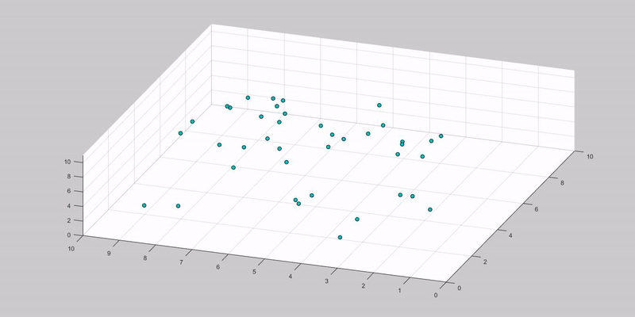

# Gravity Simulation

Simulation forces between objects, og solving the system with a Runge-Kutta Method (RK4)

## Screencapture

## Getting Started

Run the main.m file

### Prerequisites

MATLAB 2016a

## Authors

* **Håkon Gimse** - *Initial work* - [gimse](https://github.com/gimse)

